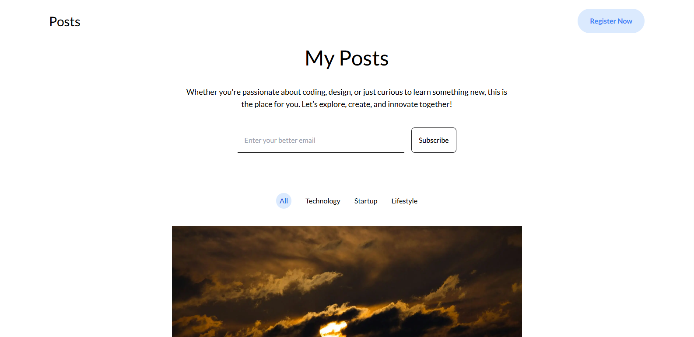
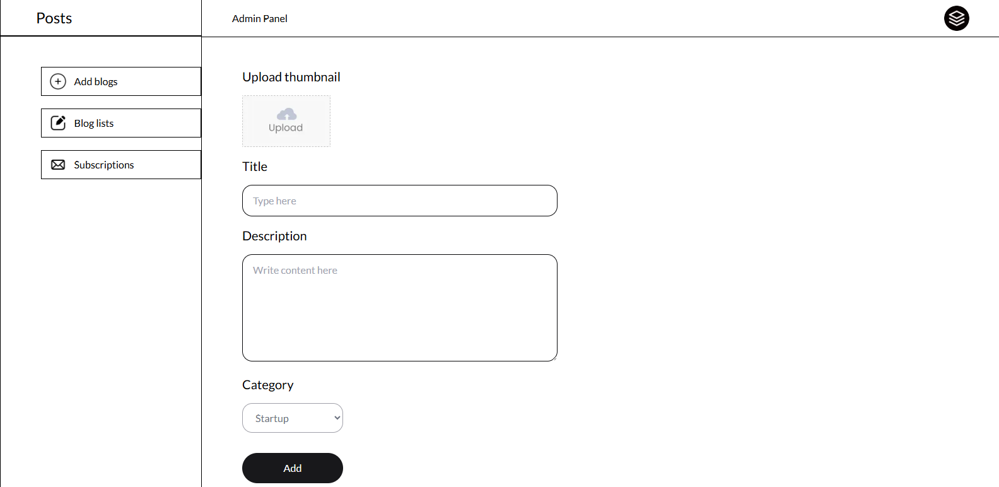

# **📝 Full-Stack Blog with Next.js, MongoDB & Tailwind CSS**  

This is a full-stack blog application built with **Next.js**, featuring **MongoDB** integration for dynamic content management. The project includes an **admin panel** that allows administrators to **create, delete, and manage blog posts**, as well as **view registered user emails**.  

The application is **fully responsive**, ensuring a smooth experience across all devices. **Tailwind CSS** was used for styling, providing a clean and modern UI with utility-first classes. To enhance performance, I implemented **motion animations** for fluid navigation and **optimized images** to reduce loading times. Additionally, **React Hooks** (`useState`, `useEffect`) were used for efficient state management, while **Axios** handles API requests seamlessly.  

---

## **🛠️ Main Features**  

- **Next.js** for a fast and efficient full-stack application  
- **MongoDB** integration for dynamic content storage  
- **Admin panel** for blog post management and email tracking  
- **Fully responsive** design for all devices  
- **Tailwind CSS** for a modern and flexible UI  
- **Smooth motion animations** for an enhanced user experience  
- **Optimized images** to improve loading speeds  
- **React Hooks** (`useState`, `useEffect`) for state management  
- **Axios** for seamless API communication  

---

## **📷 Screenshots**  

